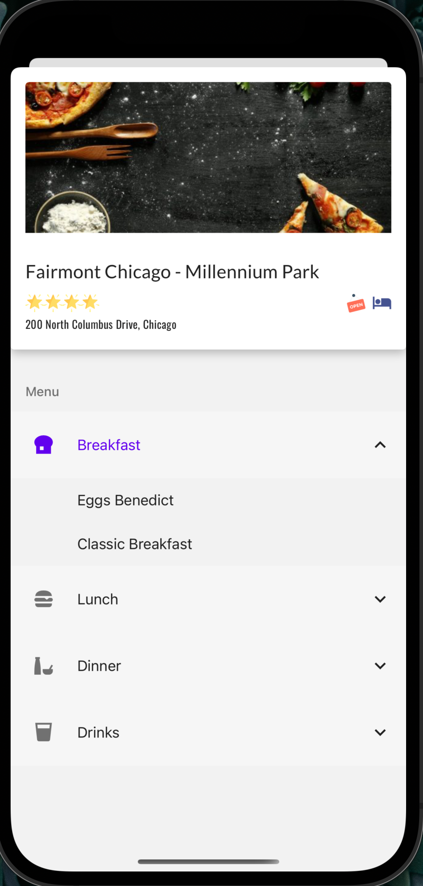

# Meals To Go

## About
This React Native application was built following the Udemy course: Complete React Native in 2022. While the architecture for the most part is the same, I went the route of using utils and StyleSheet for styles over building out styled components. I have also imported certain screens and components in a way that makes more sense to me. 

This application currently is using static JSON data to render a list of restaurants for 4 select cities; Toronto, San Fransisco, Antwerp, and Chicago. Later on in the course I will be updating the application to use Googles Places API in order to allow a user to search outside of the 4 static locations currently available. 

## Libraries used
- Components: `react-native-paper`.  
- Navigation: `@react-navigation/native` 
- Maps: `react-native-maps`

## Screenshots

